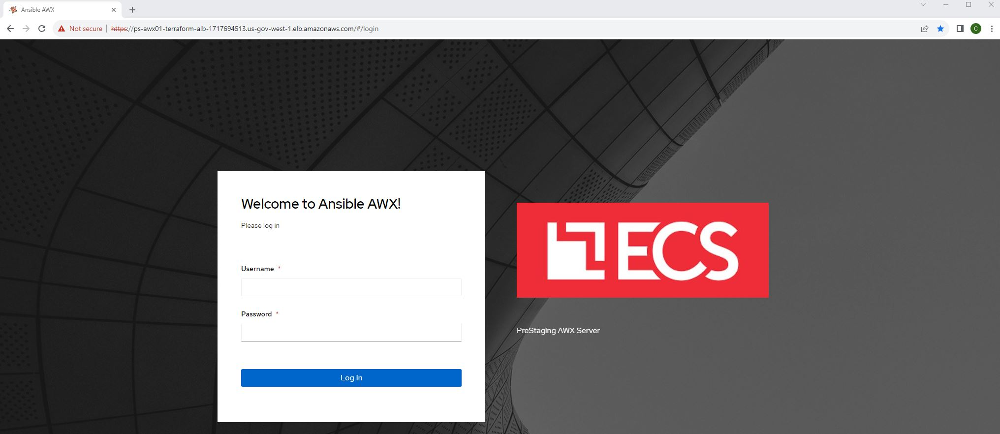
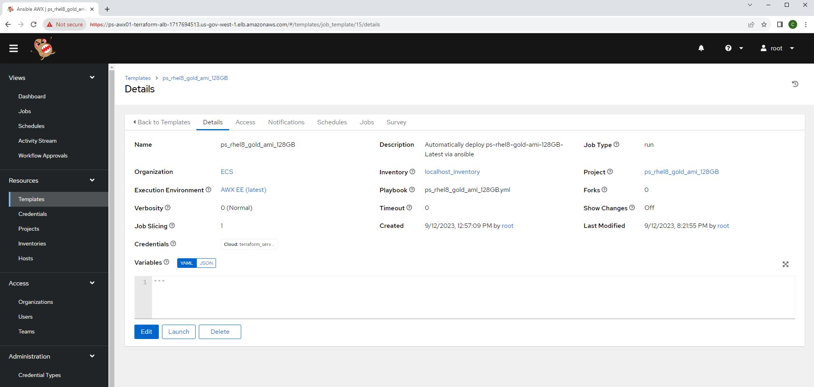
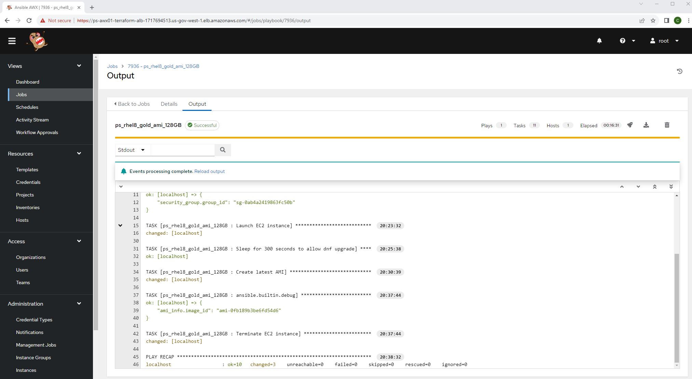
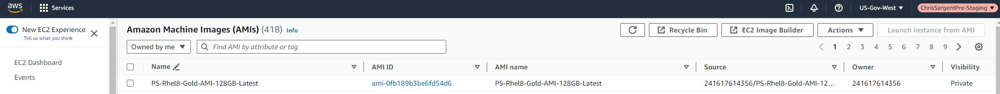

* This repository contains an ansible role to deploy a temporary EC2 from an existing AMI by ami_name, perform dnf upgrade via the user_data.sh script, delete the original AMI by searching for it by ami_name, create a new AMI from the temporary EC2 that has been updated and finally delete the temporary EC2 instance for an optimal GOLD AMI in AWS. For any additional details or inquiries, please contact me at christopher.sargent@sargentwalker.io.

* Ansible modules
# [amazon.aws.ec2_ami](https://docs.ansible.com/ansible/latest/collections/amazon/aws/ec2_ami_module.html)
# [amazon.aws.ec2_ami_info](https://docs.ansible.com/ansible/2.10/collections/amazon/aws/ec2_ami_info_module.html#ansible-collections-amazon-aws-ec2-ami-info-module)
# [amazon.aws.ec2_instance module](https://docs.ansible.com/ansible/latest/collections/amazon/aws/ec2_instance_module.html)
# [amazon.aws.ec2_security_group module](https://docs.ansible.com/ansible/latest/collections/amazon/aws/ec2_security_group_module.html)

# This project is run from PS-AWX
* You can tail -f /root/scripts/user_data/user_data.log to verify on the EC2 deployed
1. https://awxfqdn.com

2. Resources > Templates > ps_rhel8_gold_ami_128GB

3. Views > Jobs > Your job id 

4. https://console.amazonaws-us-gov.com/ > EC2 > AMI > Owned by me > PS-Rhel8-Gold-AMI-128GB-Latest

 
